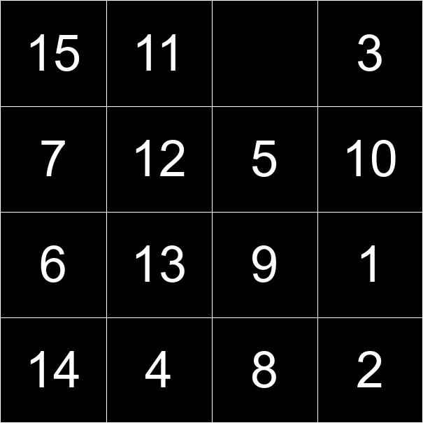
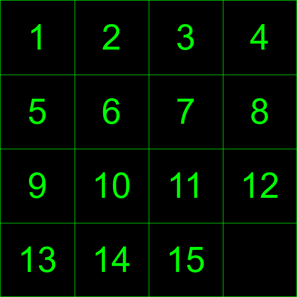

# 15-puzzle
15-puzzle, also called 'Tiles Game' or 'Puzzle of Fifteen' is sliding puzzle game, that consists of 15 numbered square tiles and one empty tile. The goal of the puzzle is to order the tiles by sliding, swapping with the empty tile.
## Example
### Unsolved

### Solved
